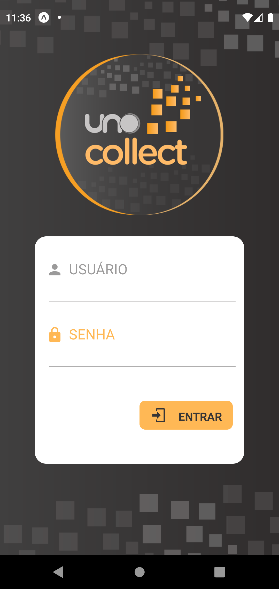
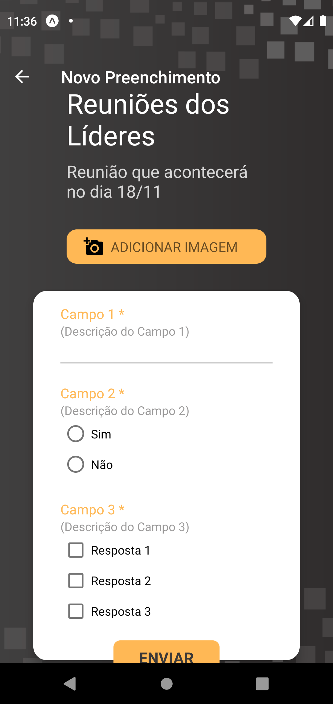

# Uno Collect - Mobile App

## Sobre o Projeto
O aplicativo Uno Collect permite o cadastro de formulários personalizados e a
inserção de respostas por usuários cadastrados.

O projeto atual é uma aplicação mobile desenvolvida para os usuários preencherem
formulários cadastrados pela administração sendo necessário o credenciamento
para o acesso.

## Tecnologias e Estrutura
O projeto foi escrito utilizando as seguintes tecnologias:

* Linguagem: [Typescript](https://www.typescriptlang.org/)
* Framework: [React Native](https://reactnative.dev/) (inicializado com o [Expo](https://expo.dev/))

O projeto foi escrito utilizando o padrão de hooks do react (React Hooks)
utilizando componentes funcionais. Dentre as pastas do projeto, se destacam:

* src: Pasta principal que contém todos os arquivos importantes do projeto.
* src/components: Pasta onde se localizam componentes reutilizáveis.
* src/pages: Pasta que contém as telas da aplicação, definidas no arquivo
  routes.tsx.
* src/services: Pasta que contém os providers utilizados no sistema.
* src/store: Pasta que contém configurações de storage utilizadas pelo Redux.
* src/utils: Pasta que contém funções utilitárias.

## Como executar o projeto
### Desenvolvimento
1. Instalar as dependências.
```bash
$ npm i

$ yarn
```

2. Copiar o arquivo .env.example nomeando como .env e setar as variáveis de
  ambiente necessárias.

3. Iniciar o projeto
```bash
$ npm run start

$ yarn start
```

4. Abrir o projeto em um emulador ou no dispositivo utilizando o cli do expo
  ou a interface web.

4. Após isso o projeto estará pronto para ser utilizado em desenvolvimento.

### Produção
1. Instalar as dependências.
```bash
$ npm i

$ yarn
```

2. Copiar o arquivo .env.example nomeando como .env e setar as variáveis de
  ambiente necessárias.

3. Gerar a build de produção de acordo com a plataforma requisitada
```bash
$ expo build:ios | expo build:android | expo build:web
```

4. Seguir as instruções de build da cli do expo.

5. Após isso serão gerados arquivos para envio para lojas de aplicativos ou
  uma web-build no caso de um pwa.




